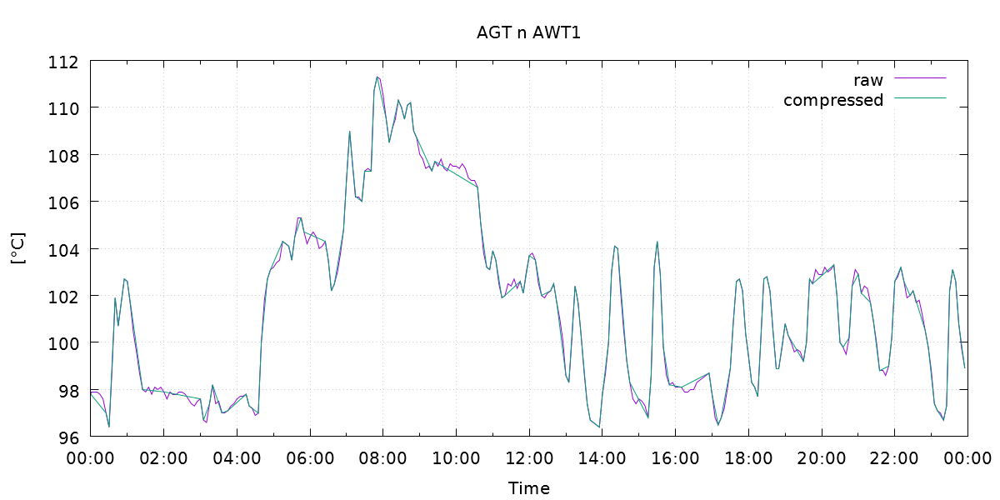
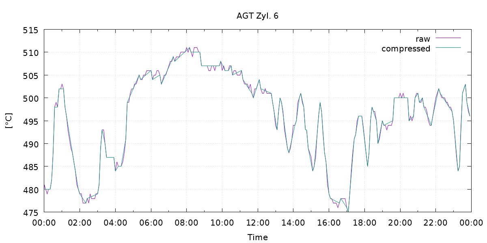
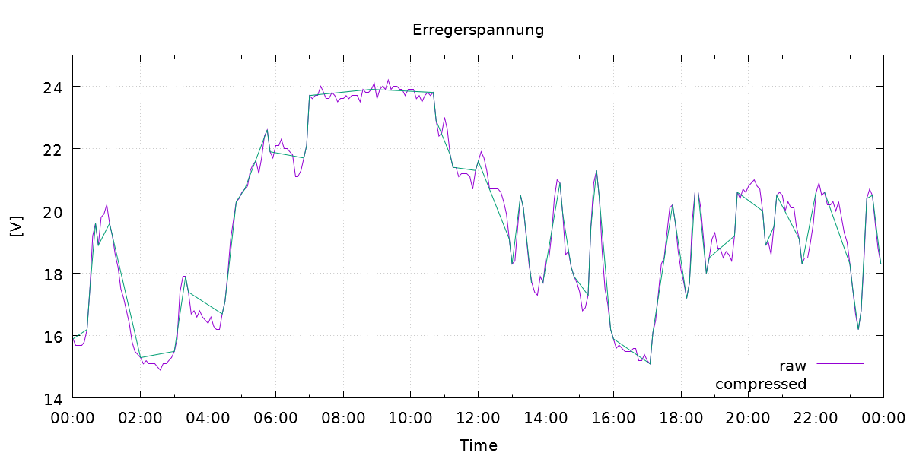

| CircleCi | NuGet | MyGet |
| -- | -- | -- |
|  |  |  |

# gfoidl.DataCompression

## Algorithms

* [Dead band](./doc/DeadBand.md)
* [Swinging Door](./doc/SwingingDoor.md)

## Demos

See `./demos` for code.

