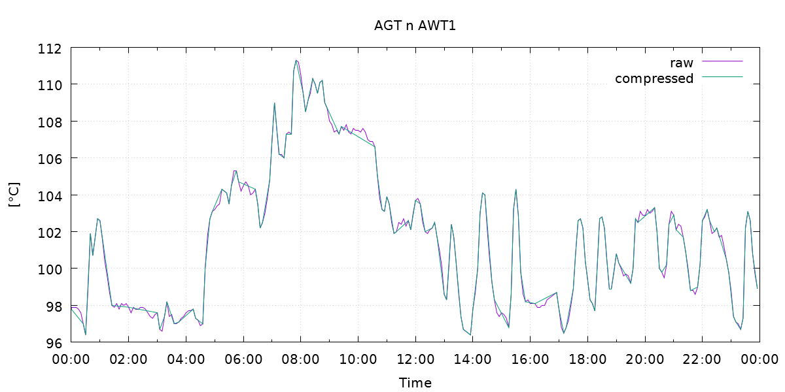
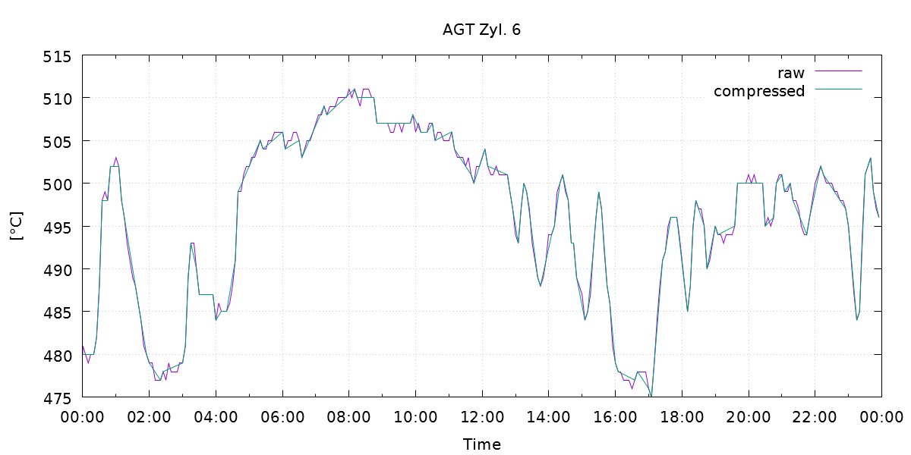
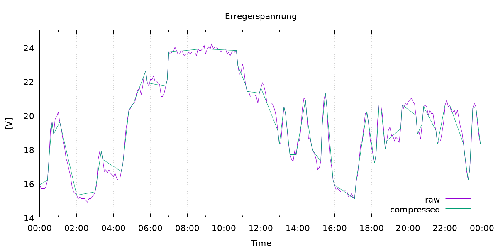

| CircleCi | CodeCov | NuGet |
| -- | -- | -- |
| [](https://circleci.com/gh/gfoidl/DataCompression/tree/master) | [](https://codecov.io/gh/gfoidl/DataCompression) | [](https://www.nuget.org/packages/gfoidl.DataCompression/) |

# gfoidl.DataCompression

## Algorithms

* [Dead band](./api-doc/articles/DeadBand.md)
* [Swinging Door](./api-doc/articles/SwingingDoor.md)

## Demos

See `./demos` for code.







## Development channel

To get packages from the development channel use a `nuget.config` similar to this one:
```xml
<?xml version="1.0" encoding="utf-8"?>
<configuration>
    <packageSources>
        <add key="gfoidl-public" value="https://pkgs.dev.azure.com/gh-gfoidl/github-Projects/_packaging/gfoidl-public/nuget/v3/index.json" />
    </packageSources>
</configuration>
```
