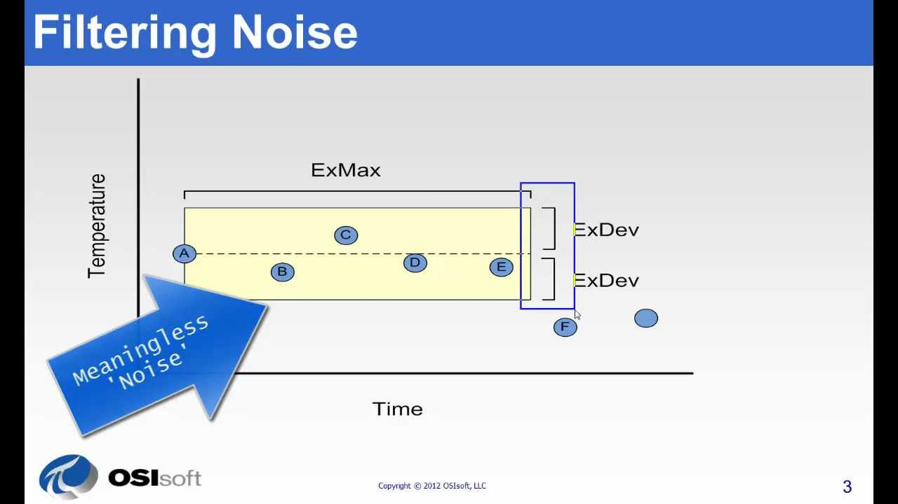

# Dead band

## Purpose

Filtering noise caused by measure- or device-errors (i.e. instrument precision).

## Description

Values that lie inbetween the dead band, defined by _ExDev_, get ommited because they are not meaningful.  
Decisions should not be based on these value. They are just noise, therefore they can be filtered out.

When a value is outside of the dead band, that value and the previous value are recored in order to maintain the trend.

## Parameters

| Name  | Description                                             |
| ----  | ------------------------------------------------------- |
| ExDev | (absolut) instrument precision                          |
| ExMax | length of x/time before for sure a value gets recoreded |

## Examples

### Trend

### Max Delta

### Error and Statistics

| Data       | # datapoints | average | sigma  | skewness | kurtosis |
| ---------- | ------------ | ------- | ------ | -------- | -------- |
| raw        | 1000         | 19.6584 | 0.1960 | -0.0330  | 2.3442   |
| compressed | 490          | 19.6623 | 0.2007 | -0.1021  | 2.4672   |

As can be seen statistics didn't change significantally, but the count of recorded datapoints was reduced -- by filtering noise -- by 51%.

## Literature

* [OSIsoft: Exception and Compression Full Details](https://www.youtube.com/watch?v=89hg2mme7S0)
