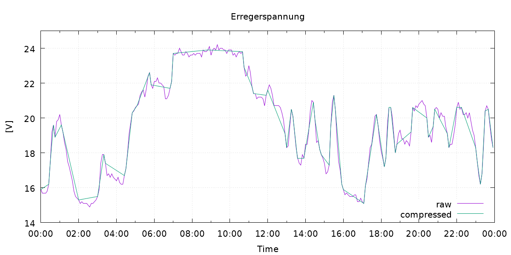

# gfoidl.DataCompression

## Algorithms

* [Dead band](./articles/DeadBand.md)
* [Swinging Door](./articles/SwingingDoor.md)

## Demos

See `./demos` for code.

_Note_: the graphs in the documentation are created by the code from `./demos`, so you can see which config-values got used.

