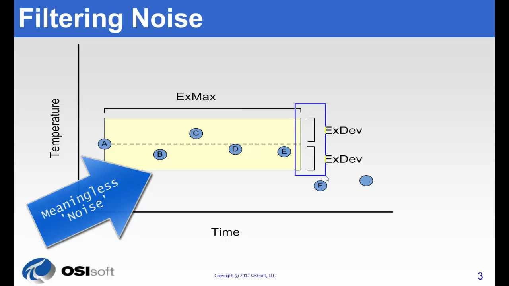
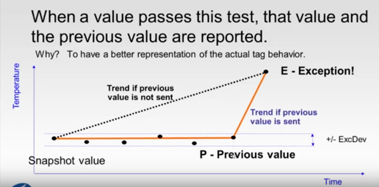
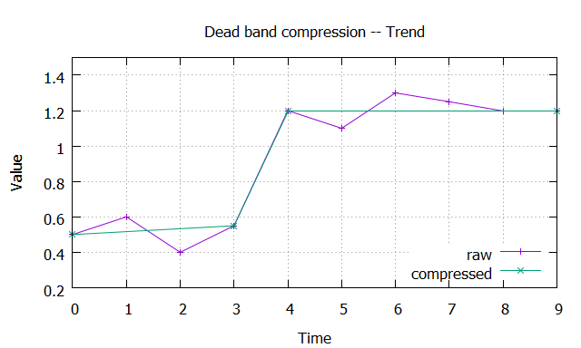
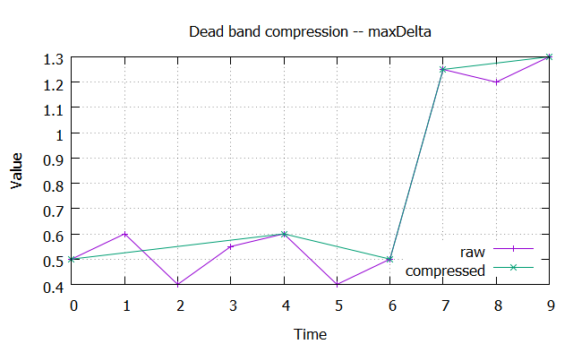
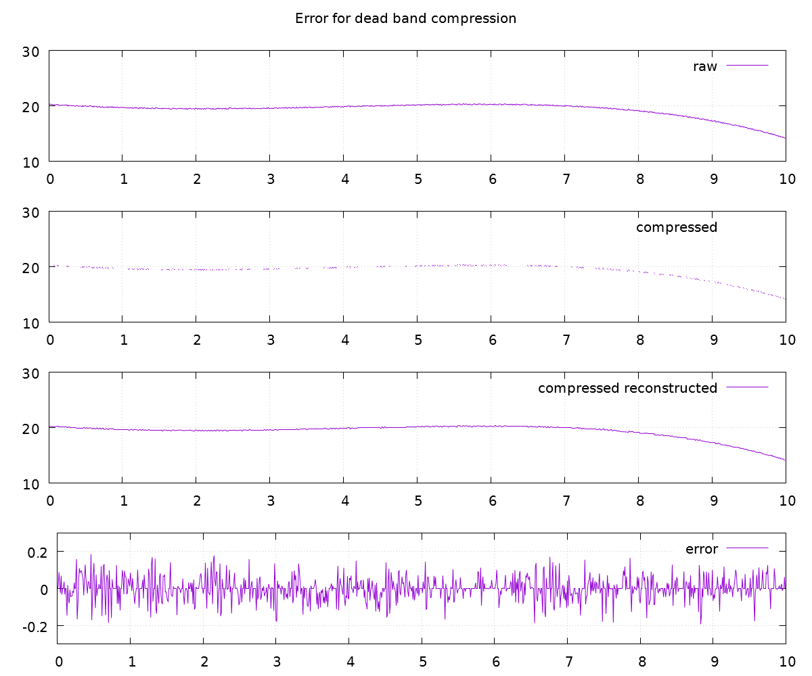

# Dead band

[TOC]

## Purpose

Filtering noise caused by measure- or device-errors (i.e. instrument precision).

## Description

Values that lie inbetween the dead band, defined by _ExDev_, get ommited because they are not meaningful. 
Decisions should not be based on these value. They are just noise, therefore they can be filtered out.

When a value is outside of the dead band, that value and the previous value are recored in order to maintain the trend.

## Parameters

| Name | Description |  
| -- | -- |  
| ExDev | (absolut) instrument precision |  
| ExMax | length of x/time before for sure a value gets recoreded |  

## Examples

### Trend

### Max Delta

### Error and Statistics

| Data | # datapoints | average | sigma | skewness | kurtosis |  
| -- | -- | -- | -- | -- | -- |  
| raw | 1000 | 19.6584 | 0.1960 | -0.0330 | 2.3442 |  
| compressed | 490 | 19.6623 | 0.2007 | -0.1021 | 2.4672 |  

As can be seen statistics didn't change significantally, but the count of recorded datapoints was
reduced -- by filtering noise -- by 51%.

## Literature

* [OSIsoft: Exception and Compression Full Details](https://www.youtube.com/watch?v=89hg2mme7S0)