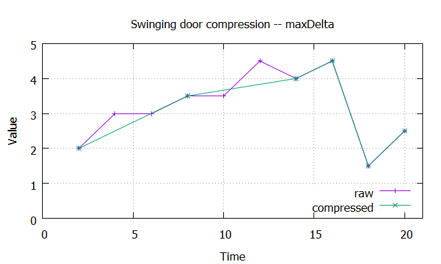

# Swinging Door

[TOC]

## Purpose

Data reduction by using the swinging door algorithm.

## Description

Beginning at the last archived value (1) and the next snapshots (2, 3, ...) a _swinging door_ is constructed,
that is only allowed to close and not to open. Green are in the figure below.

When an incoming value (6) lies outside the allowed aread, so the last snapshot and the new value get stored.  
Therefore maintaining the trend in the data.

## Parameters

| Name | Description |  
| -- | -- |  
| CompDev | (absolut) compression deviation |   
| ExMax | length of x/time before for sure a value gets recoreded |  

## Examples

### Trend

### Max Delta

### Error and Statistics

| Data | # datapoints | average | sigma | skewness | kurtosis |  
| -- | -- | -- | -- | -- | -- |  
| raw | 1000 | 19.6584 | 0.1960 | -0.0330 | 2.3442 |  
| compressed | 490 | 19.6623 | 0.2007 | -0.1021 | 2.4672 |  

As can bee seen statistics didn't change significantally, but the recorded datapoints was
reduced -- by filtering noise -- by 51%.

## Literature

* [OSIsoft: Exception and Compression Full Details](https://www.youtube.com/watch?v=89hg2mme7S0)